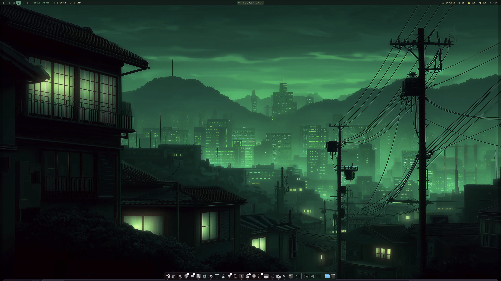
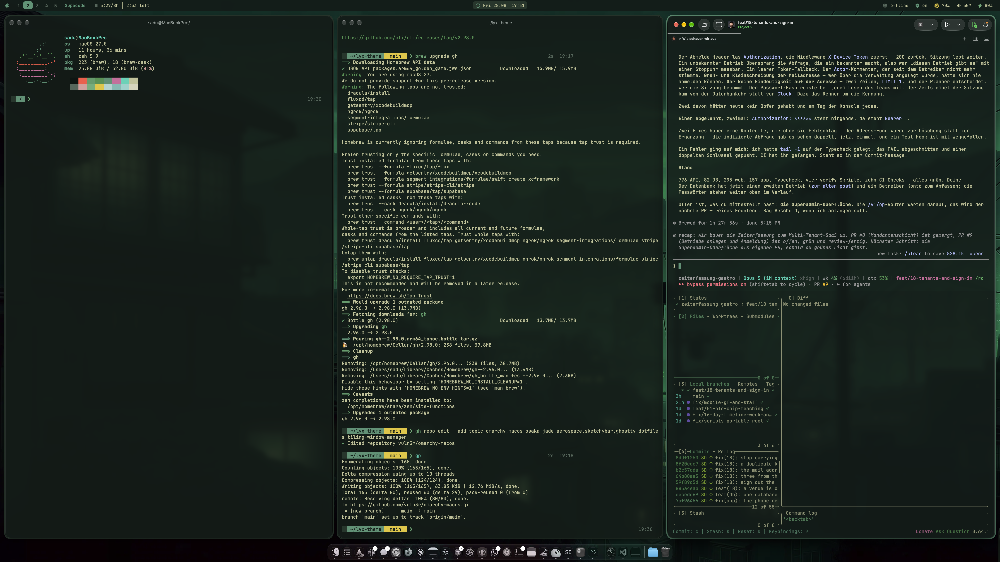
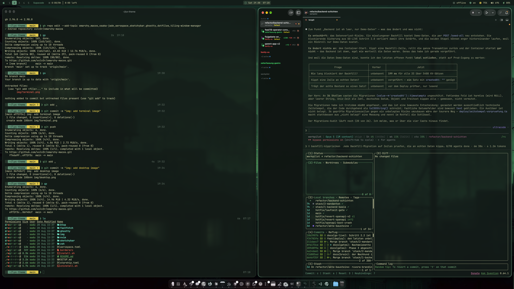
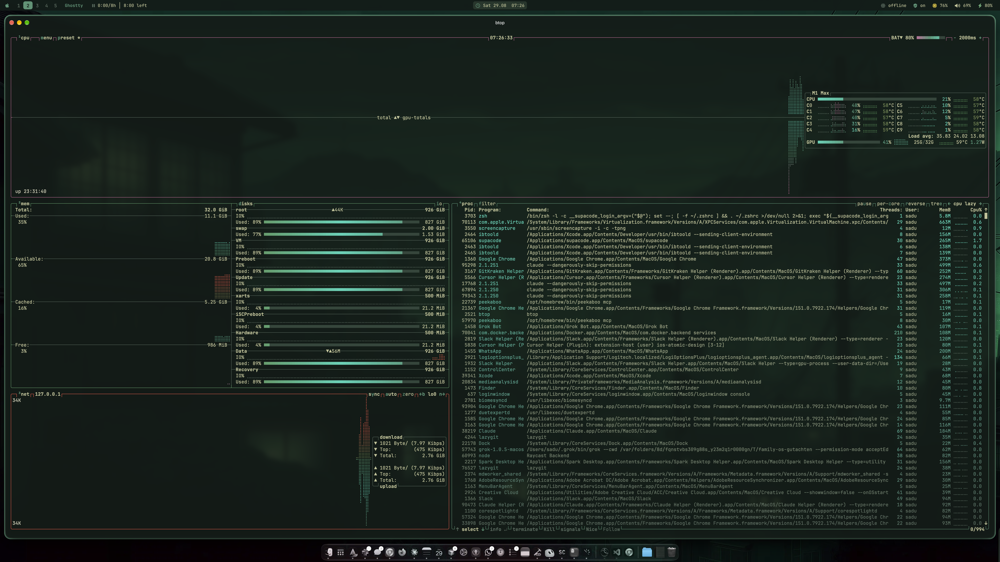

# omarchy-macos

[Omarchy](https://omarchy.org)'s look and feel on **macOS**, in **Osaka Jade**.
Windows tile themselves, a status bar replaces Apple's menu bar, the terminal
gets the Omarchy command line, and every piece shares one palette.

> **This is not Omarchy or Linux running on a Mac.** Nothing gets replaced - it
> is AeroSpace where Omarchy has Hyprland, SketchyBar where it has Waybar,
> Ghostty on both. macOS stays macOS.

> Tested on a 16" MacBook Pro (M1 Max), macOS 27.0.

## Screenshots

|  |  |
|---|---|
|  |  |
| AeroSpace tiles, SketchyBar on top, JankyBorders around the focused window | Ghostty: fastfetch, the Starship prompt, `ls` through eza |
|  |  |
| lazygit in the Osaka Jade terminal palette | btop in the Osaka Jade theme |

```
   +- SketchyBar --------------------------------------------------------+
   | 1 2 3 4 5  Ghostty  > Acme: Refactor 2:34   Fri 28.08   68% 80%     |
   +------------------------------+--------------------------------------+
   |                              |                                      |
   |           Ghostty            |               Chrome                 |
   |                              |                                      |
   +------------------------------+--------------------------------------+
      JankyBorders draws the jade frame around the focused window
```

Workspaces, the focused app and the running timer on the left, the clock in the
middle, memory, volume, battery, Tailscale and Wi-Fi on the right.

The Tailscale item reads the connection state from `scutil` and matches on the
bundle id rather than the display name, which is editable in the app. It hides
itself when Tailscale is not installed.

## What it is made of

| Piece | Role | Config |
|---|---|---|
| [AeroSpace](https://nikitabobko.github.io/AeroSpace/) | tiling WM | `aerospace.toml` -> `~/.aerospace.toml` |
| [SketchyBar](https://felixkratz.github.io/SketchyBar/) | status bar | `sketchybar/` -> `~/.config/sketchybar` |
| [JankyBorders](https://github.com/FelixKratz/JankyBorders) | window borders | `bordersrc` -> `~/.config/borders/bordersrc` |
| [Ghostty](https://ghostty.org) | terminal | `ghostty/config` -> `~/.config/ghostty/config` |
| [Starship](https://starship.rs) | prompt | `starship.toml` -> `~/.config/starship.toml` |
| [fastfetch](https://github.com/fastfetch-cli/fastfetch) | greeting | `fastfetch/config.jsonc` -> `~/.config/fastfetch/config.jsonc` |
| zsh plugin colors | typing feedback | `zsh/osaka-jade.zsh` -> `~/.config/zsh/osaka-jade.zsh` |
| [eza](https://eza.rocks), [bat](https://github.com/sharkdp/bat), [fzf](https://junegunn.github.io/fzf/), [zoxide](https://github.com/ajeetdsouza/zoxide) | the command line | `zsh/shell.zsh` -> `~/.config/zsh/shell.zsh` |
| [btop](https://github.com/aristocratos/btop) | system monitor | `btop/` -> `~/.config/btop` |
| [Neovim](https://neovim.io) | editor colors | `nvim/` -> `~/.config/nvim` |

Everything is **symlinked** into `~`, not copied, so editing here takes effect
right away. `aerospace.toml` even reloads itself on save.

## Install

```sh
git clone <repo> ~/omarchy-macos
cd ~/omarchy-macos
./install.sh
```

Needs [Homebrew](https://brew.sh) and nothing else. No `sudo`, no SIP changes,
no kernel extensions. Missing packages are installed for you, and existing
configs are moved to `.backup/` first.

Afterwards **log out and back in once** - two macOS settings only take effect
then: the hidden menu bar and the disabled Liquid Glass.

On a new Mac, AeroSpace asks for the Accessibility permission on first launch.
Without it, it cannot move windows.

Whatever cannot be scripted (launcher hotkey, Ghostty as the default terminal)
is listed in **[SETUP.md](SETUP.md)**.

## Keybindings

`alt` is the **option** key. AeroSpace grabs these combinations system wide, so
they no longer reach the app underneath.

### Focus and windows

| Keys | Action |
|---|---|
| `alt` + `H` `J` `K` `G` | focus left / down / up / right |
| `alt` `shift` + `H` `J` `K` `G` | move the window that way |
| `alt` + `-` / `=` | shrink / grow the window |
| `alt` + `/` | tiles horizontal <-> vertical |
| `alt` `shift` + `space` | floating <-> tiling |
| `alt` + `F` | fullscreen |
| `alt` `shift` + `Q` | close window |

### Apps

| Keys | Action |
|---|---|
| `alt` + `Enter` | new Ghostty window |
| `alt` + `B` | Google Chrome |
| `alt` + `S` | Slack |
| `alt` + `C` | Claude |

The app jumps to its workspace along with it, because the window rules below
send it there anyway.

> **Picking keys on a non-US layout:** AeroSpace grabs the combination system
> wide, so the character underneath is gone. On a German or Austrian layout
> `alt-L` is deliberately unbound - that one types **@**. For the same reason
> "focus right" sits on `G` rather than `L`. Avoid `Y` and `Z` as well:
> `key-mapping.preset = 'qwerty'` refers to the *physical* US position, and
> QWERTZ swaps exactly those two.

### Workspaces

| Keys | Action |
|---|---|
| `alt` + `1` ... `5` | switch workspace |
| `alt` `shift` + `1` ... `5` | move window to workspace |
| `alt` + `Tab` | back to the previous workspace |
| `alt` `shift` + `Tab` | move workspace to the next monitor |
| click a number in the bar | switch workspace |

### Service mode - `alt` `shift` + `;`

| Key | Action |
|---|---|
| `Esc` | reload the config, leave the mode |
| `R` | reset the layout tree |
| `F` | floating <-> tiling |
| `Backspace` | close every window but the current one |
| `alt` `shift` + `H` `J` `K` `L` | join windows |

### Keyboard

| Key | Action |
|---|---|
| `Caps Lock` | **Escape** - via `hidutil`, survives a reboot through a LaunchAgent |

## Windows sort themselves

`aerospace.toml` sends every app to its own workspace as it opens:

| WS | Contents |
|---|---|
| **1** | Cursor, VS Code, Xcode, GitKraken |
| **2** | Ghostty, Terminal |
| **3** | Chrome, Safari |
| **4** | Slack, Mail, Spark, Messages, Calendar |
| **5** | Claude, ChatGPT, Grok, LM Studio |

Utility windows deliberately stay **floating**: System Settings, Activity
Monitor, password managers, VPN clients, Finder, Preview. They refuse to get
narrow enough and would break tiling.

Missing an app? Grab its bundle ID and add a block to `aerospace.toml`:

```sh
aerospace list-windows --focused --format '%{app-bundle-id}'
```

```toml
[[on-window-detected]]
if.app-id = 'com.example.app'
run = 'move-node-to-workspace 3'
```

The rules only apply to **newly detected** windows. Windows that are already
open sort themselves once AeroSpace restarts.

## Time tracking

If a timer runs in [Tyme](https://www.tyme-app.com), the bar shows
`Project: Task h:mm`, then the total for today against a daily goal and how
much is left. Clicking opens Tyme. Without a running timer a dimmed pause icon
and the day's total remain; if Tyme is not running at all, the item disappears.

What is shown is the **subtask**, not the task: `trackedTaskIDs` returns the
subtask ID while the task sits in `relatedTaskID`. If your tasks are called
"Development" and "Meetings" and the real work lives in subtasks, that is
exactly what you want to see. Names are truncated past 24 characters - the
number is `maxLen` in `sketchybar/plugins/tyme.sh`, the daily goal is
`GOAL_HOURS` right above it.

## Day to day

```sh
aerospace reload-config              # reload the config (or alt+shift+; then Esc)
brew services restart sketchybar     # restart the bar
brew services restart borders        # restart the borders
```

## Tweaking

**Colors** live in one place: `sketchybar/colors.sh`. SketchyBar *and* its
plugins read from there - plugins are separate processes and never see the
variables from `sketchybarrc`, so every plugin sources the file itself.

**Bar height** is tied to two places: `--bar height` in
`sketchybar/sketchybarrc` and `gaps.outer.top` in `aerospace.toml`. The bar is
`topmost` and reserves no space of its own, so if you change the height the gap
has to follow, or the bar covers the windows at the top.

**Typing feedback** comes from
[zsh-autosuggestions](https://github.com/zsh-users/zsh-autosuggestions) and
[zsh-syntax-highlighting](https://github.com/zsh-users/zsh-syntax-highlighting).
This repo does not install them - if they are there, `zsh/osaka-jade.zsh` puts
them in the palette, otherwise it does nothing. It has to be sourced *after*
the plugins load, which is why the `omarchy-macos` block belongs at the end of
`.zshrc`.

Worth knowing if you write your own: the autosuggestion default is `fg=8`,
which in this palette means `#53685b` on `#111c18` - **2.9:1**, below every
contrast floor, which reads as "the suggestions are not working". Jade at
4.9:1 is visible without competing with real output. The syntax highlighter's
default comment style has the same problem, it is black on near-black.

**The greeting** is fastfetch, called from the `omarchy-macos` block in `.zshrc`
for interactive shells only, so scripts and the shells editors spawn stay
quiet. It costs about 10 ms; every module you add to
`fastfetch/config.jsonc` is latency in front of the first prompt. `install.sh`
also drops an empty `~/.hushlogin`, which is what silences login's "Last
login:" and "You have mail." above it.

**Window borders** live in `bordersrc`: `width` for thickness, `active_color`
and `inactive_color` for the color. Leave `style` on `round` - macOS has been
rounding window corners in the WindowServer since Big Sur, and a square border
visibly misses the rounded corner.

## Uninstall

```sh
./uninstall.sh              # configs, LaunchAgent, key mapping
./uninstall.sh --packages   # the Homebrew packages as well
```

Symlinks removed, originals restored from `.backup/`, LaunchAgent unloaded,
`hidutil` back to factory state, `.hushlogin` deleted if it is still empty,
the shell block taken out of `.zshrc` (a copy is left as `.zshrc.omarchy-macos-bak`). The macOS settings are deleted rather than
set to false - if you had configured the menu bar or transparency yourself
before, that is gone too.

## Palette - Osaka Jade

| Role | Hex | | Role | Hex |
|---|---|---|---|---|
| background | `#111c18` | | red | `#ff5345` |
| background darker | `#0c1512` | | green | `#549e6a` |
| background lighter | `#23372b` | | yellow | `#e5c736` |
| foreground | `#c1c497` | | cyan | `#2dd5b7` |
| accent (jade) | `#509475` | | magenta | `#d2689c` |
| selection | `#32473b` | | orange | `#a2734b` |
| muted | `#53685b` | | | |

From [Omarchy](https://omarchy.org), `basecamp/omarchy` ->
`themes/osaka-jade/colors.toml`. Typeface throughout is
**JetBrainsMono Nerd Font**.
